# 국내 주요 종목 주가 외부 요인 EDA

삼성전자·KOSPI 주가에 영향을 미치는 외부 요인(환율·금리·유가 등)을 분석하고 비즈니스 인사이트를 도출하는 탐색적 데이터 분석 프로젝트.

---

## 프로젝트 개요

| 항목 | 내용 |
|------|------|
| **분석 대상** | 삼성전자, SK하이닉스, NAVER, KOSPI + 외부 변수 6종 |
| **분석 기간** | 2020-01-01 ~ 2024-12-31 (5개년, 약 1,250 거래일) |
| **데이터 소스** | Yahoo Finance (`yfinance`) — Adjusted Close 기준 |
| **기술 스택** | Python 3.10 · pandas · yfinance · matplotlib · seaborn · scipy |

---

## 분석 결과 (종합 대시보드)

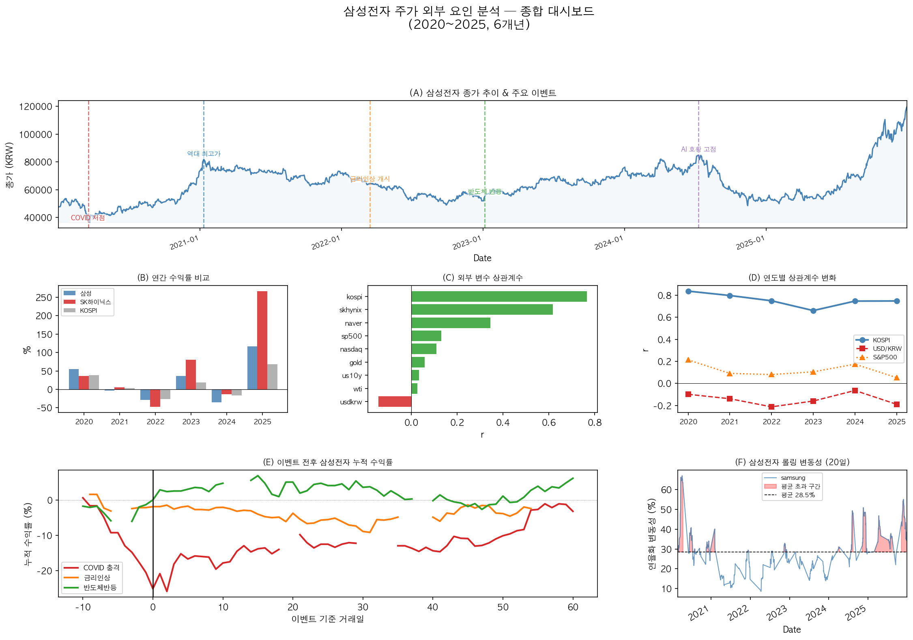

---

## 핵심 인사이트

### 1. KOSPI 동조화 강하지만 점차 약화 (r: 0.84 → 0.75)

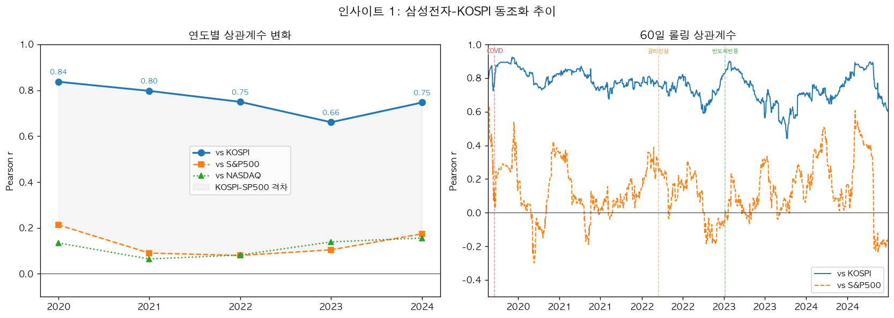

삼성전자는 KOSPI와 강하게 동조하나 2020년(r=0.84)에서 2024년(r=0.75)으로 상관이 약화됨.
반도체 업황이라는 **종목 고유 리스크**의 영향력이 커지는 추세.

---

### 2. 원화 약세 = 삼성전자 단기 역풍 (r = -0.10 ~ -0.21)

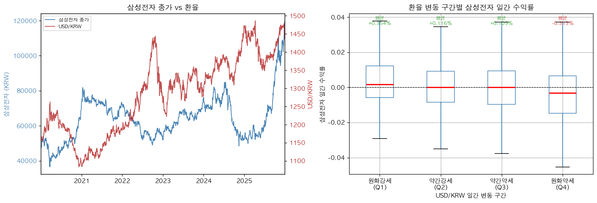

USD/KRW와의 상관계수는 음수(-0.10~-0.21). 원화 약세일에 삼성전자 수익률이 낮은 경향이 통계적으로 유의미(t-test, p < 0.05).
수출 기업임에도 단기적으로는 **외국인 매도 압력·환헤지 비용 증가** 효과가 우세.

---

### 3. 이벤트 유형에 따라 회복 패턴이 다르다

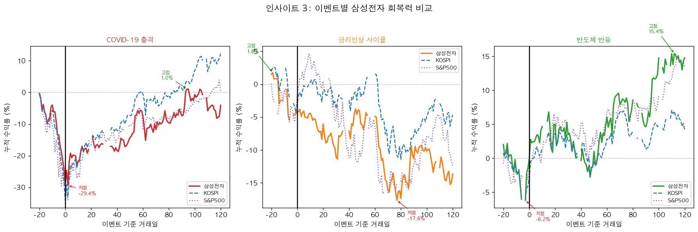

| 이벤트 | 특징 | 함의 |
|--------|------|------|
| COVID 충격(2020.03) | 급락 후 V자 반등 | 단기 역발상 매수 기회 |
| 금리인상(2022.03) | 완만한 하락 지속 | 매크로 구조적 압박 |
| 반도체 반등(2023.01) | 감산 발표로 바닥 형성 | 업황 모멘텀 중요 |

---

### 4. SK하이닉스가 삼성전자를 압도 (5년 누적: +93% vs +10%)

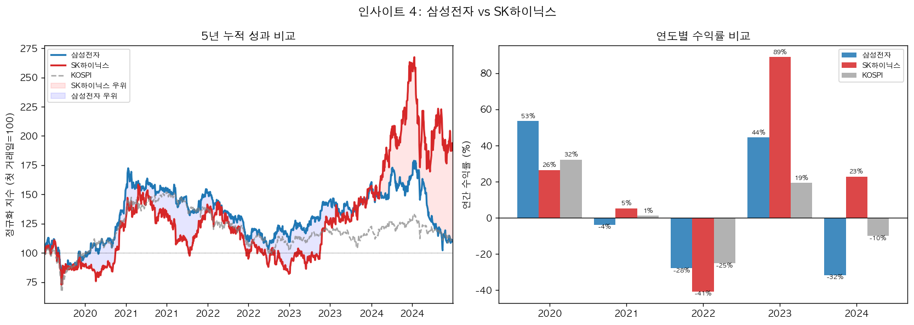

HBM(고대역폭메모리) 수혜로 SK하이닉스가 2023~2024년 크게 아웃퍼폼.
"삼성전자 = 코리아 대표주"라는 단순 접근에서 벗어난 **종목 분석 필요**.

---

### 5. 외부 변수 영향력 순위

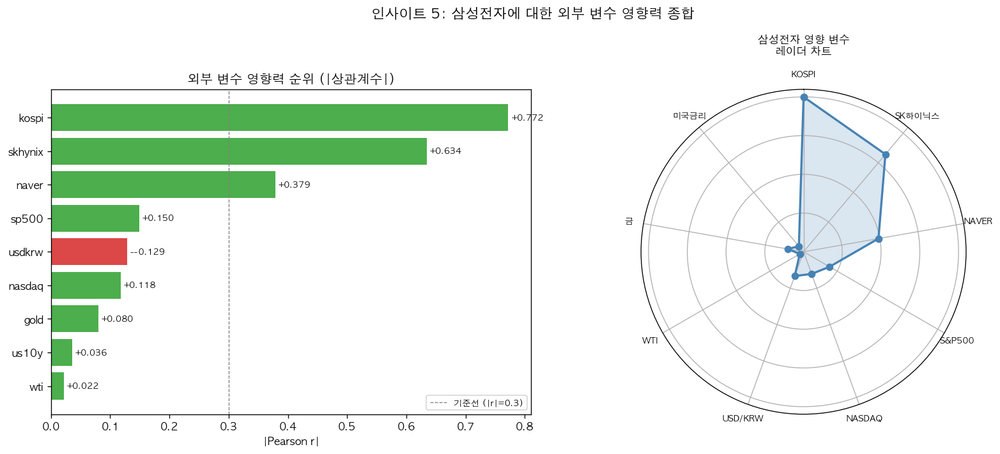

1위 KOSPI (r=0.77) → 2위 SK하이닉스 (r=0.63) → 3위 NAVER (r=0.38) → 4위 USD/KRW (r=-0.13) → 5위 S&P500 (r=0.15)

금리·유가는 직접 영향 미미 — 글로벌 증시 방향성과 환율이 핵심 모니터링 지표.

---

## EDA 시각화

### 수익률 분포 및 정규성 검정
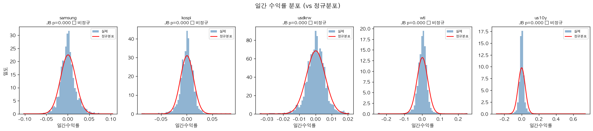

### 정규화 시계열 추이
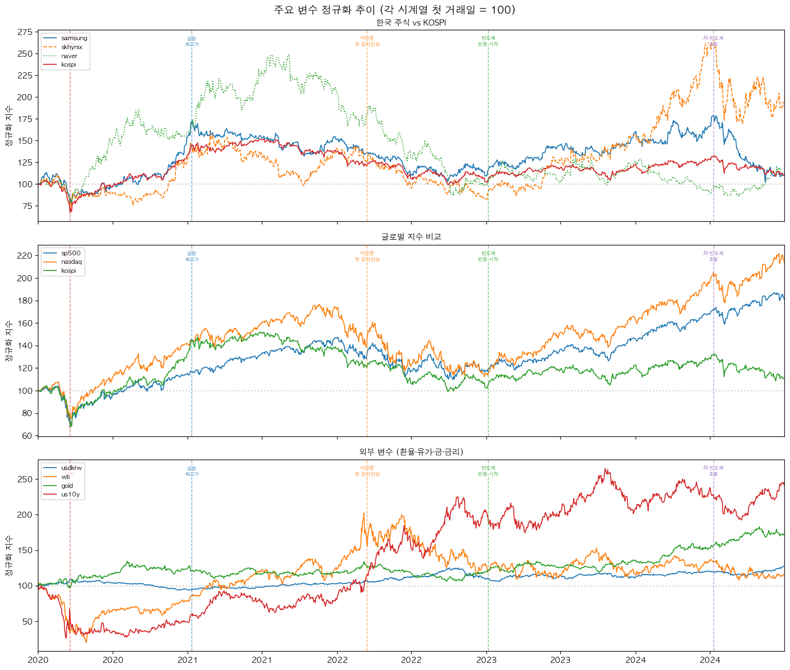

### 상관행렬
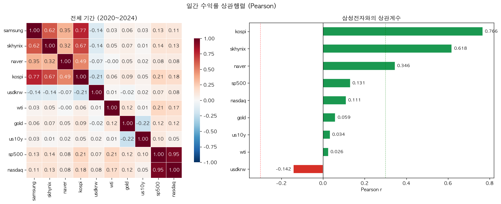

### Lag 상관관계 (선행 지표 탐색)
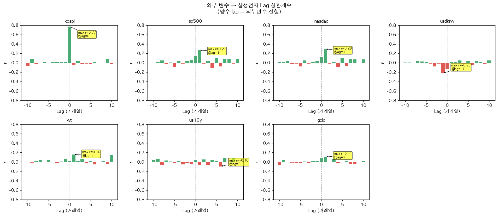

### 이벤트 전후 누적 수익률
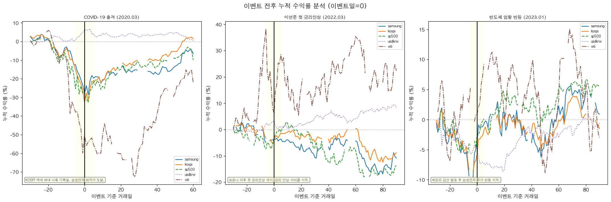

### 롤링 변동성
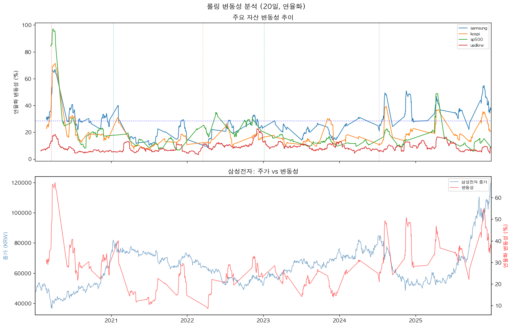

---

## 디렉토리 구조

```
korean-stock-external-factors-eda/
├── data/
│   ├── raw/                        # 원본 수집 데이터 (종목별 CSV)
│   └── processed/                  # 정제·분석 결과 (CSV, PNG)
│       ├── master_close.csv        # 통합 종가 데이터 (Wide format)
│       ├── daily_returns.csv       # 일간 수익률
│       ├── data_quality_report.csv # 데이터 품질 리포트
│       ├── data_quality_standards.json
│       ├── return_statistics.csv   # 기초 통계 (연수익률·변동성·샤프)
│       ├── rolling_correlation.csv # 60일 롤링 상관계수
│       ├── yearly_correlation.csv  # 연도별 상관계수
│       └── event_study_results.csv # 이벤트 분석 결과
├── notebooks/
│   ├── 01_data_collection.ipynb   # 데이터 수집 및 정제
│   ├── 02_eda_analysis.ipynb      # EDA 및 상관관계 분석
│   └── 03_insights.ipynb          # 비즈니스 인사이트 도출
├── reports/
│   └── analysis_report.md         # 최종 분석 리포트
└── README.md
```

---

## 수집 변수

| 변수 | 티커 | 설명 |
|------|------|------|
| 삼성전자 | `005930.KS` | KRX 시총 1위 |
| SK하이닉스 | `000660.KS` | 반도체 섹터 비교 |
| NAVER | `035420.KS` | IT 섹터 비교 |
| KOSPI | `^KS11` | 국내 대표 지수 |
| USD/KRW | `KRW=X` | 달러-원 환율 |
| WTI 유가 | `CL=F` | 원유 선물 |
| 미국 10년물 금리 | `^TNX` | 글로벌 금리 지표 |
| S&P 500 | `^GSPC` | 미국 증시 |
| NASDAQ | `^IXIC` | 미국 기술주 지수 |
| 금 | `GC=F` | 안전자산 |

---

## 데이터 파이프라인

```
yfinance API
    ↓
fetch_price_data()      # 종목별 OHLCV 수집
    ↓
data/raw/*.csv          # 원본 저장
    ↓
assess_data_quality()   # 결측률·이상치·거래량 품질 검사
    ↓
clean_price_data()      # ffill(5일) + 극단치(>30%) 대체
    ↓
build_master_dataset()  # Wide format 통합 (outer join)
    ↓
data/processed/master_close.csv
data/processed/daily_returns.csv
```

**품질 기준:**
- Close 결측률 ≤ 5%
- |일간수익률| > 30% → 전일 종가 대체
- 20~30% 구간 → 이상치 플래그 유지
- 전 종목 품질점수 75점 이상 달성

---

## 실행 방법

```bash
# 1. 가상환경 생성 및 의존성 설치
python3 -m venv .venv
source .venv/bin/activate
pip install yfinance pandas matplotlib seaborn scipy jupyterlab

# 2. 노트북 순차 실행
.venv/bin/python -m nbconvert --to notebook --execute --ExecutePreprocessor.timeout=300 \
  --output-dir notebooks/ notebooks/01_data_collection.ipynb

.venv/bin/python -m nbconvert --to notebook --execute --ExecutePreprocessor.timeout=300 \
  --output-dir notebooks/ notebooks/02_eda_analysis.ipynb

.venv/bin/python -m nbconvert --to notebook --execute --ExecutePreprocessor.timeout=300 \
  --output-dir notebooks/ notebooks/03_insights.ipynb
```
